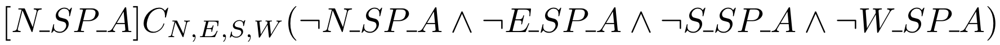
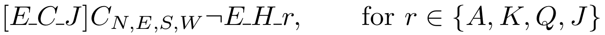
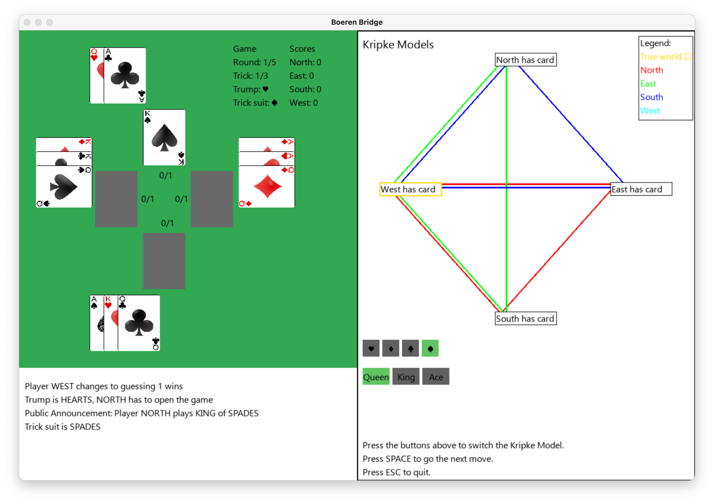
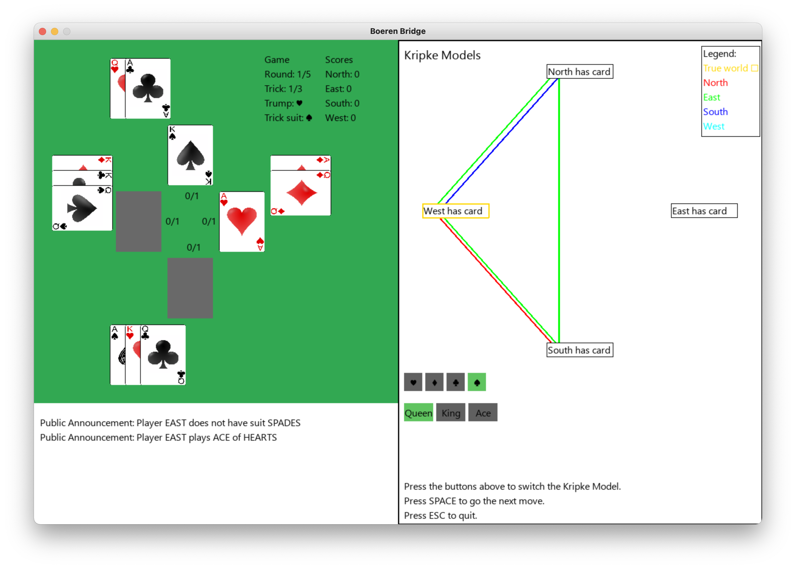
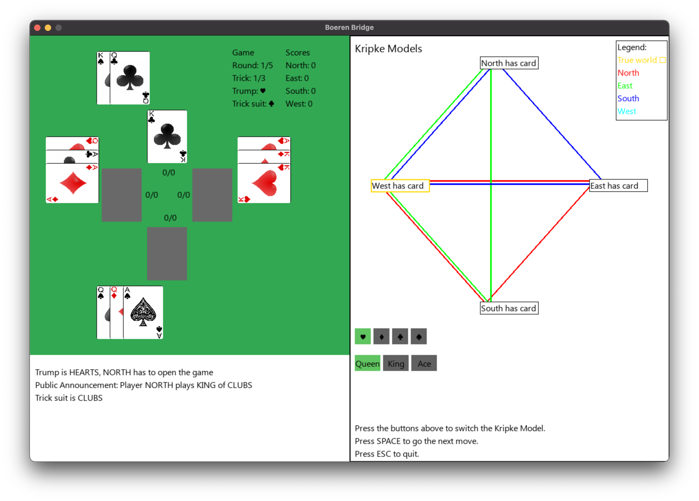
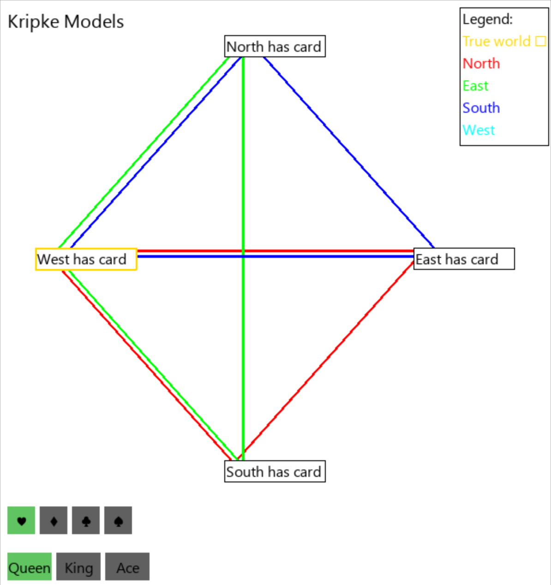
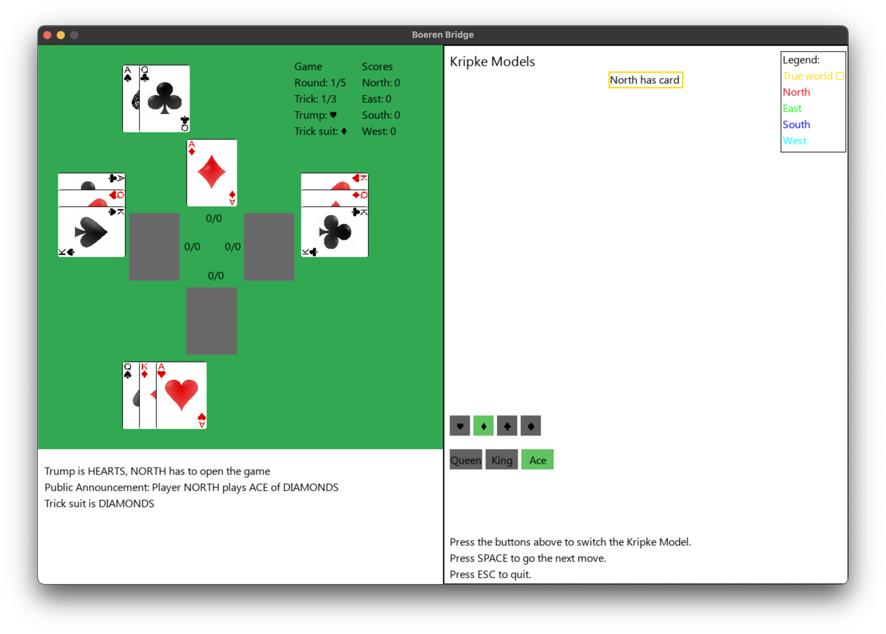
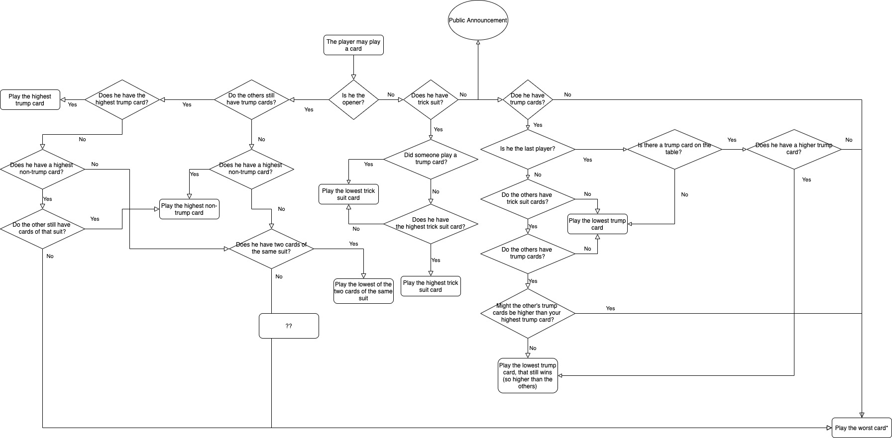
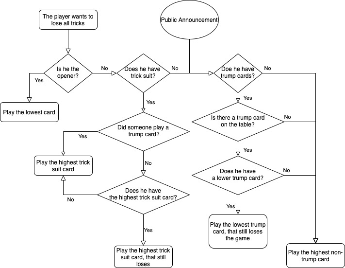

By Daan Krol (s3142221),
Jeroen van Brandenburg (s3193063) and
Julian Bruinsma (s3215601)

- [Introduction](#introduction)
- [Game Rules](#game-rules)
  * [Variations](#variations)
  * [Points](#points)
  * [Gameplay](#gameplay)
  * [Winning tricks](#winning-tricks)
  * [Number of cards](#number-of-cards)
- [Formalization](#formalization)
  * [Example 1: Announcement 'Played card'](#example-1--announcement--played-card-)
  * [Example 2: Announcement 'Does not have suit'](#example-2--announcement--does-not-have-suit-)
- [Game implementation](#game-implementation)
  * [Card Class](#card-class)
  * [Deck Class](#deck-class)
  * [Player Class](#player-class)
  * [GameModel Class](#gamemodel-class)
  * [Knowledge_base class](#knowledge-base-class)
  * [Announcement class](#announcement-class)
- [Visualization](#visualization)
  * [Game UI](#game-ui)
  * [Message box](#message-box)
  * [Kripke Model Viewer](#kripke-model-viewer)
  * [Kripke implementation](#kripke-implementation)
- [Strategy](#strategy)
  * [Playing cards](#playing-cards)
  * [Guessing](#guessing)
- [Experiments](#experiments)
- [Results](#results)
- [Discussion](#discussion)
- [Possible extensions](#possible-extensions)
  * [Q-learning](#q-learning)
  * [Tactical guessing](#tactical-guessing)
  * [Kipke knowledge in lose-graph](#kipke-knowledge-in-lose-graph)
  * [Higher order Logic (K_1K_2)](#higher-order-logic--k-1k-2-)
<!-- 
<small><i><a href='http://ecotrust-canada.github.io/markdown-toc/'>Table of contents generated with markdown-toc</a></i></small> -->

Final todo's:
- Check usage Player vs Agent
- Check if greedy kripke always plays using graph (not random if he reached the guesses)
- 'Website' layout
## Introduction

In this project, we are going to analyze the application of Kripke knowledge in the Dutch game called _Boeren Bridge_. It is a card game played with four players, in which the objective is to obtain the most points, by correctly guessing the number of tricks the player himself will take. We created agents which use playing strategies based on Kripke models, which are updated during the game with Public Announcement Logic. In this project, we are testing the performance of agents that use Kripke knowledge and compare it with agents that use simple tactics that are not based on Kripke knowledge.

[This](https://github.com/JeroenVanB/LAMAS) is the link to our github repository.

<!-- ##### TODO Research question/Wat gaan we onderzoeken/testen (moet dit bij experiments als extra?) -->

## Game Rules 

### Variations

There are many variants of the game: 'Oh hell!', 'Wizard' or 'Nomination Whist'. We decided to implement a version, which we usually play. To prevent state explosion, we simplified some game rules, e.g. the number of cards. We implemented a version with 5 rounds and only the highest cards of the normal deck of cards are used. The trump changes each round and is chosen randomly.

### Points

The aim of the game is to get the most points. Points can be obtained by winning tricks and (most importantly) correctly guessing how many tricks the player himself will take in a round.
If the player correctly guesses the total number of tricks he has taken, he will receive two points for each trick taken, with a 10 points bonus.
If the player guesses wrong, he will get two points subtracted for each trick he was off. The player with the most points after 5 rounds wins the game.

### Gameplay

In each round, each player is given _n_ cards. From a separate set of cards, one random card is picked to determine the trump of the round. Starting by the player to the left of the dealer _P1_ and continuing clockwise, every player _P_ ∈ \{_P1_, _P2_, _P3_, _P4_\} guesses the number of tricks he will win. (In the rare occasion that all the guesses sum up to _n_, the dealer has to change his guess. He has to increase or decrease his original guess with 1 such that the total is not a sum equal to _n_.)

Next, _t_ = _n_ tricks are played, in which each player plays one card. During the first trick _t_1, the player left of the dealer starts. In the following rounds, the winner of the previous trick starts. The starting player is called _the opener_. Every player after the opener should play a card matching the suit of the card played by the opener. If this is not possible, the player may play any card of his choice.

### Winning tricks

The player who played the highest card during a trick, takes the trick. The cards follow the usual order, where 2 is the lowest and Ace is the highest: (2, 3, 4, 5, 6, 7, 8, 9, 10, Jack, Queen, King, Ace). When a player plays a card of a different suit than the opener, it is considered the lowest and can never win. Trump cards, however, are always higher than the other cards.

### Number of cards

The number of cards depend on the number of rounds. The number of rounds can is determined by the players beforehand. We chose to play 5 rounds.
In every round _r_, the players is dealt _tr_ cards. First, starting in the first round with _t1 = 3_. In each following round, every player is given _tr = tr-1 + 1_ cards, up to 5 cards in total (in round 3). Then, 2 more rounds are played, where the number of cards decreases by 1. The game ends after round 5, where _n5 = 3_. See the table below for clarification.
To decrease the possible states, we minimized the number of cards used in the game. This way it is known which cards are in the game and which are not. E.g. in round 1, only the (Queen, King, Ace) of all the suits are used. This is also clarified in the table below.

<!-- | Round  | Number of cards  | Cards                      |
| ------ | ---------------- | -------------------------- |
| 1      | 3                | Queen, King, Ace           |
| 2      | 4                | Jack, Queen, King, Ace     |
| 3      | 5                | 10, Jack, Queen, King, Ace |
| 4      | 4                | Jack, Queen, King, Ace     |
| 5      | 3                | Queen, King, Ace           | -->

<table style="width:100%">
<caption>Table 1: Number of cards in each round.</caption>
  <tr>
    <th>Round</th>
    <th>Number of cards</th>
    <th>Cards</th>
  </tr>
  <tr>
    <td>1</td>
    <td>3</td>
    <td>Queen, King, Ace</td>
  </tr>
  <tr>
    <td>2</td>
    <td>4</td>
    <td>Jack, Queen, King, Ace</td>
  </tr>
  <tr>
    <td>3</td>
    <td>5</td>
    <td>10, Jack, Queen, King, Ace</td>
  </tr>
  <tr>
    <td>4</td>
    <td>4</td>
    <td>Jack, Queen, King, Ace</td>
  </tr>
  <tr>
    <td>5</td>
    <td>3</td>
    <td>Queen, King, Ace</td>
  </tr>
</table>

## Formalization
To formalize the game we make use of Public Announcement Logic (PAL) to update the Kripke S5 models, to which we will refer as Kripke models for convenience. Every time a player plays a card, he makes an announcement. By using PAL, we can reduce the number of possible states in the Kripke models and increase the common knowledge in the game. Since the announcements are always true and contain information that all the players can use, it can be used to update the Kripke models of all players. The announced knowledge has thus become common knowledge. The announcements give more information about the real world and therefore result in a decreased number of relations between possible states, and even result in some possible states to be eliminated. This can eliminate the possibilities of players having certain cards. Therefore, an announcement can result in common knowledge. For a more formal proof of the relation between PAL and common knowledge we refer to the book by _Dynamic Epistemic Logic_ by _Hans van Ditmarsch_.

To formalize the model we use the following notation: _x\_S\_r_, where _x_ ∈ \{N, E, S, W\} which are the players, _S_ ∈ \{C, SP, H, D\} and _r_ ∈ \{A, K, Q, J, 10\}. This indicates that player _x_ has (and plays) a card with suit _S_ and rank _r_.

The full names and used abbreviations of the players, suits and ranks can be found in the tables 2, 3, and 4, respectively.

<table style="width:100%">
<caption>Table 2: Player names.</caption>
  <tr>
    <th>Name</th>
    <th>Abbreviation</th>
  </tr>
  <tr>
    <td>North</td>
    <td>N</td>
  </tr>
  <tr>
    <td>East</td>
    <td>E</td>
  </tr>
  <tr>
    <td>South</td>
    <td>S</td>
  </tr>
  <tr>
    <td>West</td>
    <td>W</td>
  </tr>
</table>

<table style="width:100%">
<caption>Table 3: Suits.</caption>
  <tr>
    <th>Name</th>
    <th>Abbreviation</th>
  </tr>
  <tr>
    <td>Clubs</td>
    <td>C</td>
  </tr>
  <tr>
    <td>Spades</td>
    <td>SP</td>
  </tr>
  <tr>
    <td>Hearts</td>
    <td>H</td>
  </tr>
  <tr>
    <td>Diamonds</td>
    <td>D</td>
  </tr>
</table>
  
<table style="width:100%">
<caption>Table 4: Ranks. </caption>
  <tr>
    <th>Name</th>
    <th>Abbreviation</th>
  </tr>
  <tr>
    <td>Ace</td>
    <td>A</td>
  </tr>
  <tr>
    <td>King</td>
    <td>K</td>
  </tr>
  <tr>
    <td>Queen</td>
    <td>Q</td>
  </tr>
  <tr>
    <td>Jack</td>
    <td>J</td>
  </tr>
  <tr>
    <td>10</td>
    <td>10</td>
  </tr>
</table>

### Example 1: Announcement 'Played card'

If player North plays the Ace of Spades, no one else can hold that card. Therefore, the Kripke model of the Ace of Spades can be updated. All players only have a relation from the real world, to the real world (in which North is the owner of the Ace of Spades). After the update it is common knowledge that no one has that specific card anymore and the state is eliminated. 
the public announcement changes the common knowledge as follows:

### Example 2: Announcement 'Does not have suit'

Consider the Kripke model of the Queen of Hearts. Player South does not hold the Queen of Hearts. Player North is the opener and starts the trick by playing the 10 of Hearts. Player East plays the Jack of Clubs. If Player East had a card of the Hearts suit (the trick suit), he was obligated to play it. Since he did not, player South now knows, that he does not have the Queen of Hearts and therefore has no Hearts suit at all. Therefore, every Player can update their knowledge on the cards that Player East holds. It is now common knowledge that Player East does not hold a card with suit Hearts. For every card with the Hearts suit the state "East has card" is eliminated. 
In formal, the public announcement changes the common knowledge as follows:

## Game implementation

The game is made in Python with [Pygame](https://www.pygame.org/), using a MVC pattern and an object oriented approach. In the GameModel class, all the logic of the game is handled. The classes _Player_, _Deck_ and _Card_ facilitate an easy implementation of the logic.

### Card Class

An instance of the Card class represents a card, by keeping track of the rank, suit, owner and the value. The base value is determined by the rank, as shown in Table 5. The lowest rank, Ten, is evaluated at 8, to preserve the possibility to extend with more (lower) cards. When a card is played, the value is influenced by the trump and trick suit. When a card has the same suit as the trick suit, its value is increased by 13. When a card has the same suit as the trump, its value is increased by 26.

<table style="width:100%">
<caption>Table 5: Value of each rank. </caption>
  <tr>
    <th>Rank</th>
    <th>Value</th>
  </tr>
  <tr>
    <td>Ten</td>
    <td>8</td>
  </tr>
  <tr>
    <td>Jack</td>
    <td>9</td>
  </tr>
  <tr>
    <td>Queen</td>
    <td>10</td>
  </tr>
  <tr>
    <td>King</td>
    <td>11</td>
  </tr>
  <tr>
    <td>Ace</td>
    <td>12</td>
  </tr>
</table>

### Deck Class

During the game only one instance of the Deck class is present. It keeps track of all the cards in the game. The number of cards in the deck depends on the round, as explained in the section Game Rules.

### Player Class

The player class is an abstract class in which some basic functions are defined, such as _calculate_score()_ and _play_card()_. Many other functions consider finding a specific card of the player e.g. _get_highest_card()_ and _get_lowest_card_of_suit()_. These functions are defined here, since they can be used in different types of tactics.
The abstract class _Player_ is extended by different types of agents. The subclasses override the function _pick_card()_ and _guess_wins()_, in which the tactics are implemented. This way, we created two simple agents called the _RandomAgent_ (RA), which plays random cards, and the _GreedyAgent_ (GA), which always plays the highest cards. The two subclasses that we mainly focussed on are the _GreedyKripkeAgent_ (GKA) and _FullKripkeAgent_ (FKA). These both make use of a Kripke model, to determine which cards to play. The GKA always tries to win a trick, using a set of rules based on a Kripke model. The FKA also uses the same tactics as the GKA to win tricks, but also has a losing strategy. These exact implementation of these strategies is explained below in the section 'Strategy'.

### GameModel Class

The GameModel contains all the variables and functions to run the game. The function _next_move()_ keeps being executed in the main loop. It determines whose turn it is and checks if a trick, round or game should start or end. It also lets the current player make a move.
At the start of each round, the cards are dealt, a trump is chosen en the _opener_ is determined. In the next four steps, each player plays a card, which is added to the dictionary _table_. After the last player, _determine_winner()_ checks who played the winning card. That player becomes the new _opener_. After all the tricks of a round are finished, the points are calculated for each player. After the final round, the game ends.

### Knowledge_base class

The _KnowledgeBase_ class is constructed to represent the knowledge of every player during the game. It initizales the knowledge base by considering it possible that every other player has a card _unless_ it has the card itself. This is done by the function _knowledge_of_remaining_cards_in_deck()_. To set the knowledge of the player itself, the function _set_knowledge_of_own_hand()_ is used. The function _remove_card_ is used to remove a card from the the knowledge base of the player if the card is played by another player. The belief about the cards in the game are also determined using the functions _get_highest_card_of_suit()_ and _get_highest_non_trump_cards()_ that return the highest card of a suit and the highest trump card that are currently in the game, respectively.
The knowledge base also contains the belief about which cards are in the game and what player might have a certain card. Using the function _other_players_have_suit()_ it is determined if another player might also have the suit that you want to play. The function _player_might_have_suit()_ determines the belief of a player that other players might have a card of a certain suit.

### Announcement class

To use PAL in the game model, a _PublicAnnouncement_ class is created. If a player plays a card or cannot follow suit, he sends an announcement to all the other players in the game, which then update the corresponding Kripke model. If a player receives the announcement 'card_played', the player now does no longer consider that the other players have the card. The worlds and relations are updated accordingly to reflect this change. In the Kripke Model Viewer we show the Kripke models for a card for all players.

  
  

Above are two images of the Kripke Model viewer for the Queen of Spades. On the left we see the model before player East has made a move. Players North and South consider it possible that player East has the card. In the right image the same model can be observed after player East has made a move. East had to follow the suit of player North but he wasn't able to do so. A public announcement 'does_not_have_suit' is sent and received by all players. All players now know that player East does not have any Spades and they update all Kripke models of the Spade cards. In the Kripke Model viewer we now observe that no player thinks it is possible that East has the Queen of Spades as there are no relations, visualized by lines, to the "East has card" world.

## Visualization

To visualize the game and the Kripke models a UI class is constructed. The UI is made using Pygame which enables you to draw basic shapes such as rectangles, lines and text to positions on the screen. Cards are visualized by showing their images on the screen. In the image below you can see the full visualization of the game and Kripke model.

### Game UI

The left hand side of the UI shows the game information such as the current round, scores, trump and trick suits. For each player we show his hand to the user. Do note that the cards are of course not visible to the players in the game. They have to rely on their own knowledge about the game. At the center of the table you can see all players guesses and how many rounds they have actually won until now. The game will be paused after each move so that the user has the time to observe all game and model changes. When the user presses the spacebar the game will continue to the next move of the current player. The player, game and model states will be updated internally. The UI class is notified that there is a change and it will redraw all game elements on the left hand side of the screen.

### Message box

To give the user a better overview of what is happening in the game and models we added a status box at the bottom. This box shows messages such as who's turn it is to play, what the trump is for this round or what the current trick suit is. All public announcements can be observed here so that the user has a better understanding of the changes to the Kripke models. In the image above you can find that player West had to change it's guess since it is not allowed for the sum of guess to be equal to the number of tricks in the game.

### Kripke Model Viewer

The right hand side of the screen shows an interactive Kripke Model viewer. The screen is continuously redrawn so that we can make use of buttons to redraw parts of the viewer but also to make it independent of the game loop. The user can use the suit and rank buttons to select a card in the current game. The Kripke Model of that card is then visualized above the buttons. The model shows the knowledge of the current card.

In the image above the Kripke Model of the Queen of Hearts is visualized. The true world is shown by a golden box. Possible world relations are represented by colored lines where each color represents a player. Here, Player West has the card in its hand and thus only considers the true world possible so there is no line being drawn. All other players consider it possible that all other players have the card except for the player himself.

As this is a S5 model, it is known that there is a reflexive relation between the worlds and themselves. However, we chose to remove the reflexive relations to increase clarity in the Kripke model. To indicate the reflexive relation of the true world, i.e. the world where the player who holds the card knows that he holds the card, we highlight the box of that world.

Observe the following example of a game:

North has just opened the game and a public announcement is made that he played the Ace of Diamonds. It is now common knowledge that North has/had the Ace of Diamonds. On the right we find the Kripke model of this card. Since there is only one possible word, the true world, we remove all other worlds.

<!--
### Kripke implementation

We build an agent that determines which card to play, based on Kripke knowledge. For every card in the game, the agent has a Kripke model with four different states. Each of the states correspond to one of the four players holding the card. Each of the agents have a set of relations between the possible states. We visualize the Kripke models using a graphical representation next to the game UI. A screenshot can be seen in figure 1.

 -->

## Strategy

### Playing cards

The Greedy Kripke Agent and Full Kripke Agent use the Kripke models to determine which card to play. The GKA is greedy, since he only has a strategy to win a trick. Since a good strategy can become very complex (especially in a programming language), the rules are also presented in the win-graph below (made with draw.io).

[Rules for winning using a Kripke model](greedy_kripke.jpg)

The FKA extends the GKA, by also using applying moves based on strategy to deliberatly lose tricks when the guessed wins are already reached. The strategy for losing is also presended in the lose-graph.
TODO mention that the lose-graph does not yet make use of Kripke knowledge. This can be done in the future (ref to possible extensions)

[Rules for losing using a Kripke model](kripke_graph_lose.jpg)

Examples of applied strategies:

- When a player is the opener, playing the highest trump card will always win the trick (GKA/FKA)

  This strategy is implemented in the win-graph in the following path:

  - Is he the opener? -> Yes
  - Do the others still have trump cards? -> Yes
  - Does he have the highest trump card? -> Yes
  - Play the highest trump card

  The question 'Do the others till have trump cards?' can be answered by using the Kripke models. If the player considers it possible that one of the players owns a trump card, the answer to the question is yes. In other rounds trump cards can be used to 'steal' tricks from the player that played the highest (non trump) trick suit card. Therefore, opening with the highest trump card is a good habit, which forces the other players to play their trump cards. This way, the opener will remain the opener in the next round, in which stealing tricks is less likely (since there are less trump cards in the game).

- When a player knows that he has the highest card of the trick suit, playing that card will often win the trick (GKA/FKA)

  This strategy is implemented in the win-graph in the following path:

  - Is he the opener? -> No
  - Does he have trick suit? -> Yes
  - Did someone play a trump card? - No
  - Does he have the highest trick suit card? -> Yes
  - Play the highest trick suit card

  The agent has to make assumptions about the game in order to play a good strategy. In the win-graph one of the questions is "Does he have the highest trick suit card?". Using his knowledge about all possible trick cards in the game, the agent can make the right move. However, it is not always certain if the other players still have trick suit cards. If they don't, they might use a trump card to win the trick anyway. This shows that our graph is not certain of leading to a win, but we believe it definitely has a high chance of doing so.

- A player already has reached his guessed wins, so he wants to lose tricks. In a trick, another player played a trump card. He does have the highest trick suit card in the game, so he plays it. (FKA)
  This strategy is implemented in the lose-graph in the following path:

  - Is he the opener? -> No
  - Does he have trick suit? -> Yes
  - Did someone play a trump card? -> Yes
  - Play the highest trick suit card

  The player wants to lose all following tricks, since he has already reached his goal. High (non-trump) cards are likely to win tricks. It is difficult to lose tricks with them. Therefore, it is a good habit to play them when someone else has played a trump card.

Unfortunately, the lose-graph does not use make use of Kripke knowledge. The graph was heuristically created to optimize the play of the agent. We did think of some exceptional rules that do take the Kripke knowledge into account, but these situations are very rare. An example is explained in the section 'Possible Extensions'

### Guessing

The guessing is a very important part of the game. Since tactical guessing results in rather complex behavior we heuristically determined two simple approaches. The RandomAgent randomly guesses a number between 0 and the number of tricks. All the other agents use a system in which uses a the average mean of the cards (_mean_value_hand_) in the hand is compared to the mean value of all the cards in the game (_mean_value_game_). These values are calculated using the function _pre_evaluate()_ in the Card class, which take the trump into account (but ignores the trick suit, since there is none). If the _mean_value_hand_ is less than 90% of _mean_value_game_, the player guesses 0 tricks. If it is between 90% and 110% of _mean_value_game_, the player guesses he will win 1/4th of the total trick. Between 110% and 130%, he guesses 2/4ths of the total tricks. For more than 130%, the player guesses to win all tricks. This method uses all the available knowledge at the start of the game: which cards the player has and which other cards are in the game.

## Experiments

To test the performance of the four different agents (Random, Greedy, GreedyKripke, FullKripke), they all played against eachother. The performance is averaged over 100.000 games.

## Results

Table 6 shows the mean scores and standard deviation after four different agents have played 100.000 games against one another. We can see that the standard deviation is relatively large. This is due to the fact that a winning player wins 10 points plus two times the number of tricks it has won. However, if it does not reach its number of tricks or it gets too many tricks it gets negative points. This is a fine line between winning and losing, which is why the scores can differ throughout the game, even with good tactics. 

<table style="width:100%">
<caption>Table 6: Mean scores per player </caption>
  <tr>
    <th>Player</th>
    <th>Mean Score</th>
    <th>Standard Deviation</th>
  </tr>
  <tr>
    <td>Greedy</td>
    <td>21.04</td>
    <td>15.84</td>
  </tr>
  <tr>
    <td>Greedy Kripke</td>
    <td>20.52</td>
    <td>15.62</td>
  </tr>
  <tr>
    <td>Full Kripke</td>
    <td>23.57</td>
    <td>15.50</td>
  </tr>
  <tr>
    <td>Random</td>
    <td>-3.65</td>
    <td>14.75</td>
  </tr>
</table>

Table 7 shows the mean wins and standard deviation after four different agents have played 100.000 games against one another, while aiming for the most wins. Note that the GreedyKripkeAgent and FullKripkeAgent use the same strategy to win. Therefore, the results are the same.

<table style="width:100%">
<caption>Table 7: Mean scores per player </caption>
  <tr>
    <th>Player</th>
    <th>Wins</th>
    <th>Standard Deviation</th>
  </tr>
  <tr>
    <td>Greedy</td>
    <td>4.66</td>
    <td>2.17</td>
  </tr>
  <tr>
    <td>Greedy Kripke</td>
    <td>5.00</td>
    <td>2.18</td>
  </tr>
  <tr>
    <td>(Full Kripke)</td>
    <td>(4.99)</td>
    <td>(2.18)</td>
  </tr>
  <tr>
    <td>Random</td>
    <td>4.35</td>
    <td>2.08</td>
  </tr>
</table>

## Discussion

TODO update: GKA does not outperform GA (Greedykipke is better, see average tricks won. He just does not stop winning. He's out of control!)

The results in Table 6 show that Agents who use strategies which are based on Kripke knowledge (GKA, FKA) outperform simple agents (RA, GA). The RA clearly performs the worst, while the GKA performs the best.

- GKA is very similar to Greedy (Almost always plays high cards)
  The GreedyKripkeAgent performs very similar to the GreedyAgent. This can be explained by the fact that their playstyle is very similar. They guess their wins using the same strategy and if they do not want to win a trick, they both play a random card. They only differ in their playing style when trying to win tricks. The GKA uses Kripke knowledge, where the GA always plays the highest card. However, the strategy of GKA often leads to playing the highest card, which results in similar play.

- We only play with few cards
  In our experiments we play 5 different rounds, with a maximum of 5 cards. We deliberately chose this setup, since the optimal strategy is more difficult to find in games with more cards. As with more cards the strategy can be much more complex than the one that the agents use. We therefore simplified the game to enable us to heuristically create strategies based on Kripke models. This might thus not be a complete representation of the real game but that was not the goal of this project. 
  
  The Greedy agent will always pick his highest card from his hand. As this strategy could work when there are few cards in the game, when more cards are added the higher the possibility that it will have no high cards left in his hands and will not reach its guess. It will also continue with a winning strategy even if it has reached its guess. In contrast, the Full Kripke player is implemented as such that tries to win tricks by playing its lowest card that still wins. This will result in higher cards at the end of the game and could increase the probability of reaching the guess. Additionally, it does not try to win when it has already reached its guess. 
  
- The Strategy based on Kripke models is heuristically determined (and FKA loss-graph is not optimized (see Extensions))
  The strategy based on the Kripke models is heuristically determined. The implemented strategies are based on our own experience of the game and therefore might be sub-optimal. This can obviously influence the conclusion of our experiments (weather or the use of Kripke models is useful in card games like this).
  Also the losing strategy of the FKA is heuristically determined. This can influence the results in the same way.
  
- The guessing is similar across 3 of the agents
  A player can only obtain points if he guesses his wins correctly. The implementation of the guesses is the same across the three agents GA, GKA and FKA. To confirm the influence of the Kripke models on the capabilities of the agents, we also tested the agents in a setup where they always tried to win. I.e. they did not use their losing strategies, when they reached their guessed wins. These results are shown in Table 7. The difference in score indicates how well the differen strategies work. When an agent tries to win, the strategie of the GKA and FKA outperforms the GA and RA.
  

## Possible extensions

### (Deep) Q-learning

A possible extension for inferring tactics is implementing a (Deep) Q-Learning algorithm. Instead of implementing rules based on the knowledge base manually, we train a Q-Learning network to extract these rules and tactics itself. The network could have a Kripke model as an input as it is a perfect representation of the state.

The card game can be seen as a Markov Decision Process (MDP). We will define the state, action and reward as the following:

- State _S_: A list of 52 one hot encoded vectors, one for every card. Each card representation consist of 4 bits, one for every player. Here a 1 will represent a possible owner, and 0 otherwise. 
- Action _A_: A list of 52 possible cards to play. Since the player only has a subset of these cards, the possible actions can be reduced, based on the available cards.
- Reward _R(s,a)_: Results in a 1 for a win, and a 0 for a loss. The effect of using the real in-game score rewards could also be used. 

Using the representation of the MDP we can use Q-learning in combination with a multilayer perceptron as a function approximator. This function will approximate Policy P, which is choosing the action with the highest expected reward.

The implementation of such an algorithm is not the main goal of the course, but it could be interesting to combine Kripke models with a deep reinforcement learning algorithm. After training, the influence of different Kripke models on the tactics of the algorithm can be investigated. To see if the Kripke models can actually benefit the Q-learning agent, its performance could be compared to that of a greedy Kripke agent (without Q-learning) or to Q-learning agent that uses a different state represenation that does not contain Kripke knowledge. 

### Tactical guessing

Our implementation of the game is a simplified version because of time constraints. As previously discussed we focus only on 'greedy guessing' in which the agent guesses the number of plays he will win. The player then uses a greedy tactic to get the most wins out of the game. While this results in a relatively good score this is only played by beginners. In Boeren Bridge players often use 'tactical guessing'. This means guessing and playing for 0 wins. This can get you bonus points if you succeed and can result in more points. However the player has to adopt a whole new tactic. The question is now "How can I lose my high cards without winning the trick?". It would be interesting to extend our implementation so that there are agents that use the Kripke models for both greedy and non-greedy dynamic behavior.

It would be interesting to extend the Q-learning approach mentioned above with tactical guessing. A second neural network could be used to make a correct guess and to chose which tactic to apply: greedy or non-greedy.

### Kipke knowledge in lose-graph

Currently, FKA is the only agent that uses the lose-graph. As mentioned before, the implemented strategies do not use Kripke knowledge, since it would be excessive for the current setup. However, the strategies can be extended by applying more rules, which do make use of Kripke knowledge. Consider the following example for a losing strategy:

- Is he opener -> Yes
- Do you have the highest card of a non-trump suit -> Yes
- Does anyone not have cards of that suit, but still have trump cards? -> Yes
- Do those players still need a win, and will he try to win the trick? -> Yes
- Play that highest non-trump suit card

The second and third question are based on knowledge provided by the Kripke models. The second question can be answered by checking the Kripke models of higher trick suit cards (higher than the one the player is holding). If these models do not consider it possible that other players hold it, the question can be answered with 'Yes' (the questioning agent holds the highest). The third question can be answered by first checking if there are possible states in which the other players do not have trick suit cards, but still have trump cards. The fourth question is much more difficult to answer, since this question depends on the play style of other agents. This considers knowledge that is not certain (will the player play that card?), which could be implemented using probabilities (is it a likely move). Since we believe these implementations are outside the scope of this project, we leave this for further research.

### Higher order Logic (K_1K_2)

<!-- TODO: Uitwerken punten
-We only use PAL and K1
-Make use of the fact that a player uses a certain strategy for guessing
-Make use of the fact that a player uses a certain strategy for playing cards
-Not that well applicable for games with few cards -->

Currently, we only make use of PAL and first order knowledge. After an announcement a player knows something about someone else, but we do not represent that the player knows the other players know that he knows. As in our implementation the agent only uses a strategy for both guessing and playing cards, it is not necessary to use higher order knowledge. 
For guessing, the player only needs to know the value of its cards. He does not know the cards of the other players and it does not matter if he knows that they know that. In the real life game of Boeren Bridge players can also make use of tactical guessing as explained above. When a player guesses 0 it might be possible that he is using tactical guessing or that he really has bad cards. When a player knows that another player knows that he is tactical guessing, he might have to change some of his tactics. Future research could take a bigger focus on this form of higher order logic. 