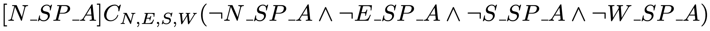
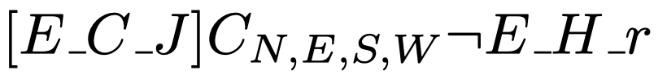
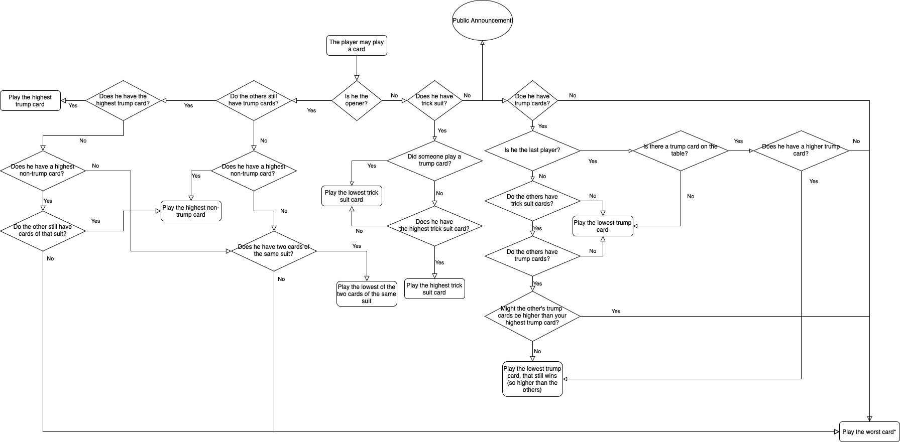

## LAMAS Project --- BoerenBridge
By Daan Krol (s3142221),
   Jeroen van Brandenburg (s3193063), and 
   Julian Bruinsma (s3215601)

### Introduction
In this project, we are going to analyze the Dutch game called _Boeren Bridge_. It is a card game played with four players, in which the objective is to obtain the most points, by correctly guessing the amount of tricks the player himself will take.

[This](https://github.com/JeroenVanB/LAMAS) is the link to our github repository.

### Game Rules

#### Variations
There are many variants of the game: 'Oh hell!', 'Wizard' or 'Nomination Whist'. We decided to implement a version, which we ourselves usually play. To prevent state explosion, we simplified some game rules, e.g. the amount of cards. We implemented a version with 5 rounds and only the highest cards of the normal deck of cards are used. The trump changes each round and is chosen randomly.

#### Points
The aim of the game is to get the most points. Points can be obtained by winning tricks and (most importantly) correctly guessing how many tricks the player himself will take in a round. 
If the player correctly guesses the total number of tricks he has taken, he will receive two points for each trick taken, with a 10 points bonus. A special reward is given to players if they correctly guess taking 0 tricks, in rounds with 6 or more cards. Here, the bonus points increase from 10 to 20.
If the player guesses wrong, he will get two points subtracted for each trick he was off. The player with the most points after 15 rounds wins the game.

#### Gameplay
In each round, each player is given _n_ cards. From a separate set of cards, one random card is picked to determine the trump of the round. Starting by the player to the left of the dealer _P1_ and continuing clockwise, every player _P_ ∈ \{_P1_, _P2_, _P3_, _P4_\} guesses the number of tricks he will win. (In the rare occasion that all the guesses sum up to _n_, the dealer has to change his guess. He has to increase or decrease his original guess with 1 such that the total is not a sum equal to _n_.)

Next, _t_ = _n_ tricks are played, in which each player plays one card. During the first trick _t_1, the player left of the dealer starts. In the following rounds, the winner of the previous trick starts. The starting player is called _the opener_. Every player after the opener, should play a card matching the suit of the card played by the opener. If this is not possible, the player may play any card of his choice.
#### Winning tricks
The player who played the highest card during a trick, takes the trick. The cards follow the usual order, where 2 is the lowest and Ace is the highest (2, 3, 4, 5, 6, 7, 8, 9, 10, Jack, Queen, King, Ace). When a player plays a card of a different suit than the opener, it is considered the lowest and can never win.  Trump cards, however, are always higher than the other cards.

#### Number of cards
The number of cards depend on the rumber of rounds. The number of rounds can usually freedly be determined by the players. We chose to play 5 rounds.
In every round _r_, the players is dealt _tr_ cards. First, starting in the first round with _t1_ = 3. In each following round, every player is given _tr_ = _tr-1_+1 cards, up to 5 cards in total (in round 3). Then, starting with 2 more rounds are played, where the amount of cards decreases by 1. The game ends after round 5, where _n5=3. See the table below for clarification.
To decrease the possible states, we minimized the amount of cards used in the game. This way it is known which cards are in the game and wich are not. E.g. in round 1, only the (Queen, King, Ace) of all the suits are used. This is also clarified in the table below.

##### Table 1
<!-- | Round  | Number of cards  | Cards                      |
| ------ | ---------------- | -------------------------- |
| 1      | 3                | Queen, King, Ace           |
| 2      | 4                | Jack, Queen, King, Ace     |
| 3      | 5                | 10, Jack, Queen, King, Ace |
| 4      | 4                | Jack, Queen, King, Ace     |
| 5      | 3                | Queen, King, Ace           | -->

<table style="width:100%">
  <tr>
    <th>Round</th>
    <th>Number of cards</th>
    <th>Cards</th>
  </tr>
  <tr>
    <td>1</td>
    <td>3</td>
    <td>Queen, King, Ace</td>
  </tr>
  <tr>
    <td>2</td>
    <td>4</td>
    <td>Jack, Queen, King, Ace</td>
  </tr>
  <tr>
    <td>3</td>
    <td>5</td>
    <td>10, Jack, Queen, King, Ace</td>
  </tr>
  <tr>
    <td>4</td>
    <td>4</td>
    <td>Jack, Queen, King, Ace</td>
  </tr>
  <tr>
    <td>5</td>
    <td>3</td>
    <td>Queen, King, Ace</td>
  </tr>
</table>

### Game implementation

The game is made in Python (with pygame), using an MVC pattern and a object oriented approach. In _game_model.py_, all the logic of the game is handled. The classes _Player_, _Deck_ and _Card_ facilitate an easy implementation of the logic. The class _Player_ is extended by different types of agents, such as _RandomAgent_ (which plays random cards), _GreedyAgent_ (which plays the highest cards) and _GreedyKripkeAgent_ (discussed below).

### Kripke implementation

We build an agent that determines which card to play, based on Kripke knowledge. For every card in the game, the agent has a Kripke model with four different states. Each of the states correspond to one of the four players holding the card. Each of the agents have a set of relations between the possible states. We visualize the Kripke models using a graphical representation next to the game UI. A screenshot can be seen in figure 1.

Every time a player plays a card, he makes an announcement. By using Public Announcement Logic, we can reduce the amount of possible states in the Kripke models. 

To formalize the model we use the following notation: _x\_S\_r_, where _x_ ∈ \{N, E, S, W\} which are the players, _S_ ∈ \{C, SP, H, D\} and _r_ ∈ \{A, K, Q, J\}. This indicates that player _x_ has (and plays) a card with suit _S_ and rank _r_.

##### Example 1 - Announcement 'Played card'
If player North plays the Ace of Spades, no one else can hold that card. Therefore, the kripke model of the Ace of Spades can be updated. All players only have a relation from the real world, to the real world (in which North is the owner of the Ace of Spades). After the update it is common knowledge that no one has that specific card anymore. 
the public announcement changes the common knowledge as follows:

##### Example 2 - Announcement 'Does not have suit'
Consider the Kripke model of the Queen of Hearts. Player South does not hold the Queen of Hearts. Player North is the opener and starts the trick by playing the 10 of Hearts. Player East plays the Jack of Clubs. If Player East had a card of the Hearts suit (the trick suit), he was obligated to play it. Since he did not, player South now knows, that he does not have the Queen of Hearts and therefore has no Hearts suit at all. Therefore, every Player can update their knowledge on the cards that Player East holds. It is now common knowledge that Player East does not hold a card with suit Hearts. 
In formal, the public announcement changes the common knowledge as follows:

for all _r_ ∈ \{A, K, Q, J\}.

### Strategy

The GeedyKripkeAgent uses the kripke models to determine which card to play. He is greedy, since he always tries to win the trick. Since a good strategy can become very complex (especially in a programming language), the rules are also presented in the graph below (made with draw.io). 

Possible strategies are:
- When a player knows that he has the highest card of the trick suit, playing that card will often win the trick
- When a player does not have a card of the trick suit, he can play a trump card

The guessing is a very important part of the game. Since the guessing takes place before playing any cards, the only knowedge that the agent has, are his own cards (and the trump suit). We still have to come up with a way to determine a good estimation. It seems likely, that we will create a rule, based on the average score of the cards in the hand.

### Possible extensions
A possible extension for inferring tactis is implementing a (Deep) Q-Learning algorithm. Instead of implementing rules based on the knowledge base manually, we train a Q-Learning network to extract these rules and tactics itself. The network could have a Kripke model as an input as it is a perfect representation of the state. 

The card game can be seen as a Markov Decision Process. We will define the state, action and reward as the following:
- State _S_: A list of 52 one hot encoded vectors (one for every card). Each card representation consist of 4 bits, one for every player. Here a 1 will represent a possible owner, and a 0 the opposite.
-  Action _A_: A list of 52 possible cards to play. Since the player only has a subset of these cards, the possible actions can be reduced, based on the available cards.
- Reward _R(s,a)_: Results in a 1 for a win, and a 0 for a loss (we might consider adding a discount factor)

Using the representation of the MDP we can use Q-learning as a function approximation. This function will approximate Policy P, which is choosing the action with the highest expected reward. 

The implementation of such an algorithm is not the main goal of the course, but it could be interesting to combine Kripke models with a deep reinforcement learning algorithm. After training, we can investigate what influence the different Kripke models have on the tactics of the algorithm. 

### Visualization 

